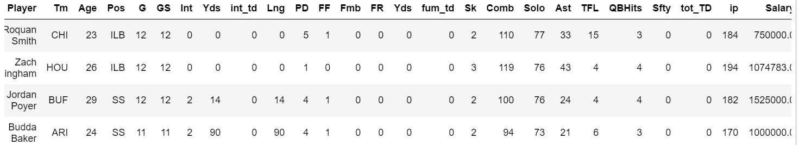
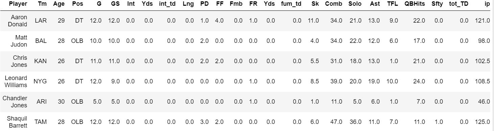
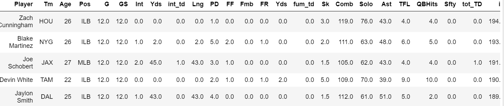
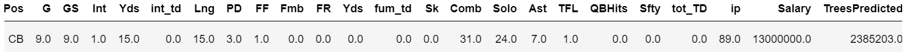
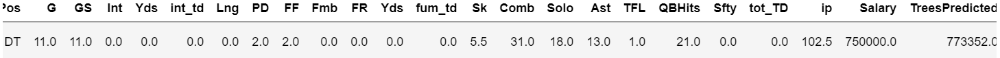
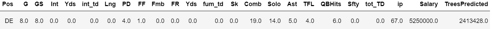

# stat426project

# Question
One of the biggest points of contention in sports is to determine a salary for professional atheltes. You especially hear it in the NFL mainly about ofensively players, but what about the defense? My purpose and question is to determine which defensive players in the NFL are worth their contract?

# Goal
Since the question is pretty vague I will specifically look at a few defensive players in the NFL with completely different contracts and see what my models say. 

# Data
Using webscrapping techniques, I grabbed my data from a website called pro-football-reference which contains player statistics and also salary data. I will have about 26 features and Salary will be my target. I also wanted to judge player performance by a statistic called Individual Points (IP). This is a stat used by sports statisticians to put a value on individual players. The equation is based on defensive stats and games played and is calculated as such:
```
df['ip'] = df['G'] + (5*df['GS']) + df['Sk'] + (4*df['FR']) + (4*df['Int']) + df['Comb'] + (5*df['tot_TD'])
```
The data table comes out as such:



# EDA
Before we start modeling, lets looks at some of the players with the top salary and best ip scores. Starting with salary:



Aaron Donald is the highest paid defender and he has a decent ip score. Looking at the low scores of Matt Judon and Chandler Jones their ip scores are low, but mostly it's because of injuries/Covid-19 this year so I'm not too worried.
Now with the best ip scores:



It's interesting to see all linebackers at the top here which makes sense. You can see the salaries on my main coding file, but the highest salary was Jaylon Smith. Most of these guys have super low contracts because of how young they are. Maybe a big contract is coming up soon? 

# Modeling
Now to the fun part. To start off I wanted to use pipes because it was easier for me to sort through the table to determine which features were objects or floats. I decided to use two different models linear regression, and decision trees:
```
#Linear Regression
full_lm_pipeline = Pipeline([('pipeline', pipeline),
                         ('lm', LinearRegression())])
full_lm_pipeline.fit(X_train, y_train)
yhat_lm = full_lm_pipeline.predict(X_test)
#Decision Trees
full_tree_pipeline = Pipeline([('pipeline', pipeline),
                         ('tree', tree.DecisionTreeRegressor(min_samples_leaf=16))])
full_tree_pipeline.fit(X_train, y_train)
yhat_tree = full_tree_pipeline.predict(X_test)
```
By finding the RMSE and the MAE for each model, by far it was determined that decision trees was the better model. So because of that, I will be using all my predictions from my decision trees model. 

# Results
After incorporating the predictions into the original dataframe we can now look at what the model thought was the correct salary for players. For this purpose I'm going to pick three different players with completely different contracts.

Stephon Gilmore:



Gilmore is considered the best cornerback in football. His numbers are lower this year which is probably why the model thinks his salary should be lower.

Chris Jones:



It seems as though the model agrees with the current salary of Jones based on his numbers. Jones is one of the more solid defensive players especially for the Chiefs.

Jadeveon Clowney



Clowney was a big storyline during the offseason. He thought he was worth a lot more than what NFL teams were willing to pay. Statisitcally his numbers aren't great, but is the eye test what attracts him to teams? It's interesting that teams wanted to only pay $2 million for him and that's what the model says as well.

# Conclusion
In looking through the data I noticed that a lot of nfl players have the same contracts. Especially when it comes to rookie contracts, most deals are the same, so sometimes I think the model would predict based on similar contracts of players instead of looking at the stats. However, that poses the biggest question in sports, is it all about the analytics or the eye test? Using both will be the most powerful tool to determine which players are worth the money. 
